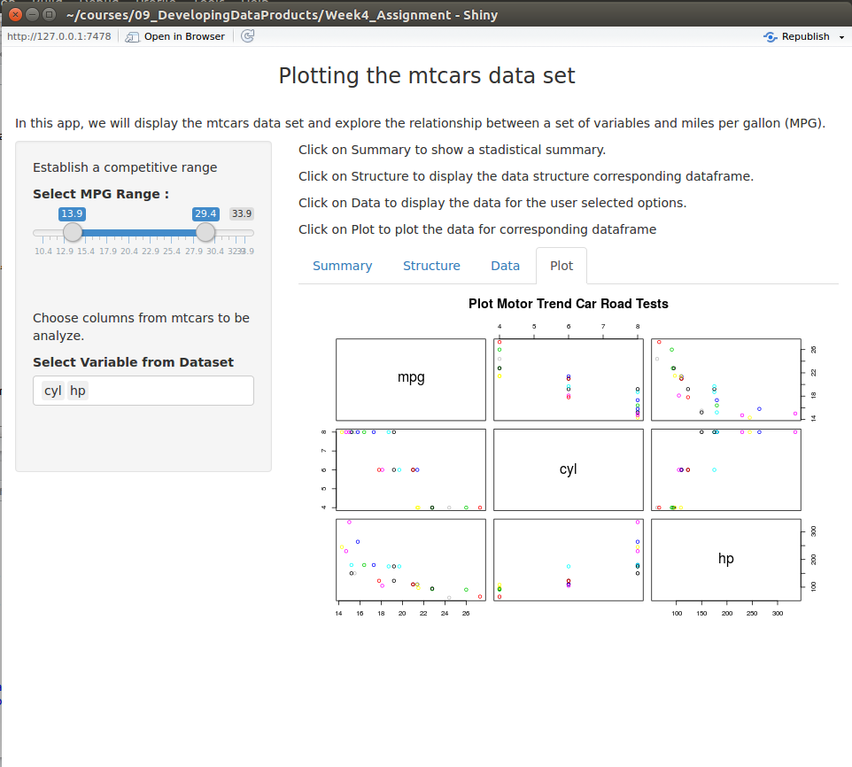

## Executive Summary

This detailed analysis has been performed to fulfill the requirements of the course project for the course Developing Data Products offered by the Johns Hopkins University on Coursera. In this project, we will display the mtcars data set and explore the relationship between a set of variables and miles per gallon (MPG) which will be our outcome.

The main objectives of this research are as follows:

1. To create a Shiny Application which is available at the Shiny website
https://omarlatorre.shinyapps.io/Week4_Assignment/
2. To create a R Presentation which is available at Github repository https://omarlatorre.github.io/Week4-Assignment/index.html  

The files is available at Github repository https://github.com/omarlatorre/Week4-Assignment

--- .class #id1 

<!-- ## To create a Shiny Application : -->
<!-- Review criteria for this assignment is as below : -->

<!-- - Was there enough documentation on the shiny site for a user to get started using the application? -->
<!-- - Did the application run as described in the documentation? -->
<!-- -Was there some form of widget input (slider, textbox, radio buttons, checkbox, …) in either ui.R or a custom web page? -->
<!-- -Did server.R perform some calculations on the input in server.R? -->
<!-- -Was the server calculation displayed in the html page? -->
<!-- -Was the app substantively different than the very simple applications built in the class? Note, it’s OK if the app is simple and based on the one presented in class. I just don’t want it to be basically a carbon copy of the examples we covered. For example, if someone simply changed the variable names, then this would not count. However, a prediction algorithm that had a similar layout would be fine. -->
<!-- -Here’s your opportunity to give the app +1 for being well done, or neat, or even just a solid effort. -->

<!-- --- .class #id2  -->

<!-- ## To create a R Presentation : -->

<!-- The Presentation is available at Github repository https://omarlatorre.github.io/Week4-Assignment/index.html   -->

<!-- Review criteria for this assignment is as below : -->

<!-- - Was the presentation completed in slidify or R Presenter? -->
<!-- - Was it 5 pages? -->
<!-- - Did it contain an R expression that got evaluated and displayed? -->
<!-- - Did it contain an R expression that got evaluated and displayed? -->
<!-- - Was it hosted on github or Rpubs? -->
<!-- - Was the server calculation displayed in the html page? -->
<!-- - Here’s your opportunity to give this presentation a +1 for being well done. Did they tinker around with the default style? Was the presentation particularly lucid and well organized? In other words, the student made a legitimate try. -->
<!-- - There were no R errors displayed in the presentation. -->

<!-- --- .class #id3  -->

## Aplication
URL for Shiny application is https://omarlatorre.shinyapps.io/Week4_Assignment/

The Application contains :

Left Pane :
- Select MPG Range using Slider Range. Data Range contains minimum mpg as 10.4 and maximum mpg as 33.9.
- Select Variable from Dataset. This is a multi select text field which contains columns from mtcars such as: mpg, cyl, disp, hp, drat, wt, qsec, vs, am, gear, and carb.

Main Panel :
There are four panes in main panel as below :
- Summary : This displays summary for the data as per user selection.
- Structure : This displays Strucutre for the data as per user selection.
- Data : This displays data frame for the user selected options.
- Plot : This displays plot for corresponding dataframe

--- .class #id5

## R code 

```r
library(shiny)
library(ggplot2)

#Read Data
library(datasets)
data(mtcars)
head(mtcars)
```

```
##                    mpg cyl disp  hp drat    wt  qsec vs am gear carb
## Mazda RX4         21.0   6  160 110 3.90 2.620 16.46  0  1    4    4
## Mazda RX4 Wag     21.0   6  160 110 3.90 2.875 17.02  0  1    4    4
## Datsun 710        22.8   4  108  93 3.85 2.320 18.61  1  1    4    1
## Hornet 4 Drive    21.4   6  258 110 3.08 3.215 19.44  1  0    3    1
## Hornet Sportabout 18.7   8  360 175 3.15 3.440 17.02  0  0    3    2
## Valiant           18.1   6  225 105 2.76 3.460 20.22  1  0    3    1
```

--- .class #id4

<!-- ## Summary Tab -->

<!--  -->

<!-- --- .class #id6 -->

<!-- ## Structure Tab -->

<!--  -->

<!-- --- .class #id7 -->

<!-- ## Data Tab -->

<!--  -->

<!-- --- .class #id8 -->

## Plot Tab



<!-- --- .class #id9 -->

<!-- ## Thank you -->
<!--  -->
